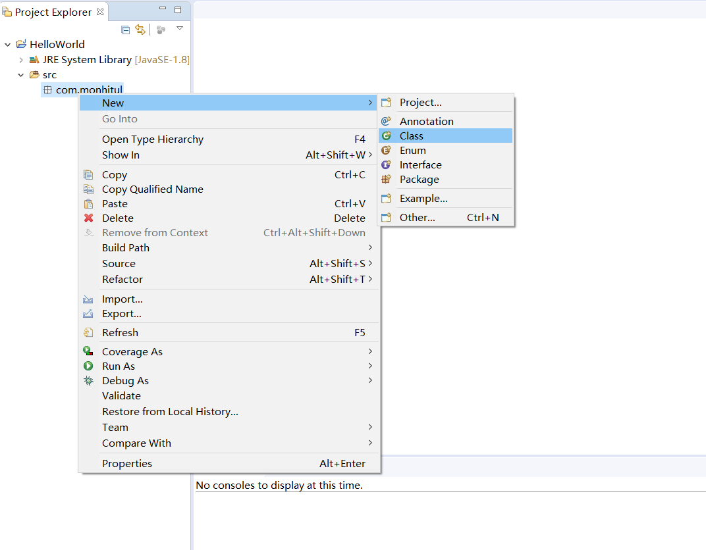

## JDK安装与配置
要进行Java的程序开发，就必须要有Java开发工具包（Java Development Kit，JDK）的支持。

我们可以从Oracle官网（www.oracle.com/technetwork/java/javase/downloads/）上直接下载。


选择最新的``Java SE 10.0.2``，选择``JDK``下载，然后选择相应的平台，我这里使用的是Windows平台的。

下载完成后，打开进行安装，这里选择的安装目录是``D:\Java\jdk-10.0.2\``，这个目录后面需要用到。


点击下一步就开始进行安装。

安装成功后还不能进行开发，我们需要配置相应的环境变量。

首先选择“我的电脑”，右键选择“属性”，选择“高级系统设置”，然后选择“环境变量”。

进入到“环境变量”对话框后，在“系统变量”中找到``Path``变量，对其进行“编辑”，在其最后面加上“;D:\Java\jdk-10.0.2\bin”，其中``;``为不同“Path”之间的分隔符。

再找到``CLASSPATH``变量，对其进行“编辑”，在其最后加上“;D:\Java\jdk-10.0.2\lib”。

这样就好了，我们来测试一下是否成功。

可以打开“cmd”，输入“java”或“javac”，可以看到该指令存在且用法，则成功，如果说没有该指令则失败。

## “Hello World！”

我们打开一个记事本文件，写入这样的一段代码：
```
public class Hello{		//定义一个类
	public static void main(String[] args){		//主方法
		System.out.println("Hello World!");		//在屏幕上打印输出
	}
}
```

记住，文件要保存成``.java``后缀的，否则不能使用。这里保存成``hello.java``，保存到D盘目录下。

然后在``cmd``里输入``javac hello.java``，先对文件进行编译，成功后再输入``java hello``，则可看到cmd里输出“Hello World!”。

## Eclipse的使用
使用记事本当然可以写程序，不过使用IDE也可以帮助我们更好的写程序，IDE可以帮我们检查代码拼写，还可以语法高亮，便于查看，可以节省时间进行开发。

我们这里介绍的是Eclipse的使用，当然，还有很多优秀的IDE，大家可以自行了解。

先到Eclipse官网（https://www.eclipse.org/downloads/）下载安装包。


选择相应版本下载。

然后安装到本地，安装过程就不多说了，按默认点“下一步”就可以了。

安装完成后我们打开Eclipse。


接下来我们来新建一个Java工程，实现上面“Hello World!”的功能。

点击“File”，选择“new”，“project”，弹出对话框里选择“Java”目录下的“Java Project”，点击“next”。

弹出Project设置对话框，输入“Project Name”为“HelloWorld”，这就是工程的名称，点“next”。再点“finish”。

接下来，按下图操作，右键工程目录下的``src``，选择``Package``，这里命名为“com.monhitul"。


接下来新建class，如图。



“name”填写“Hello”，其他默认，点击“finish”。

就会出现这么一个：


我们再把上面“Hello World”的代码写进来。

点击顶部的“Run”图标，一个绿色的播放键，即可进行编译运行。

可以看到下面的控制台输出了跟上面用记事本同样的效果。

这篇就到这。