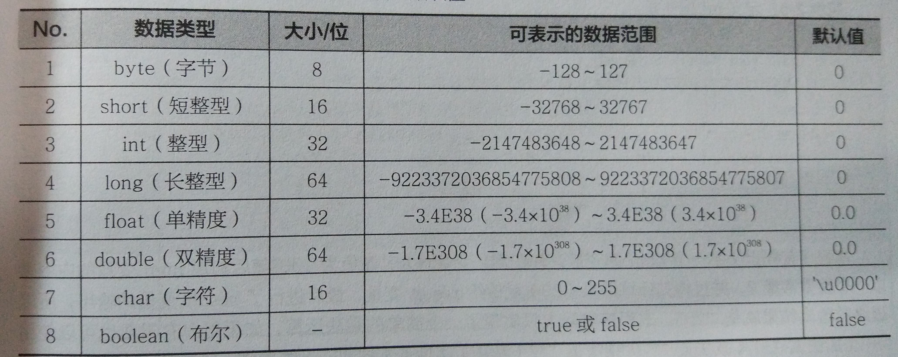
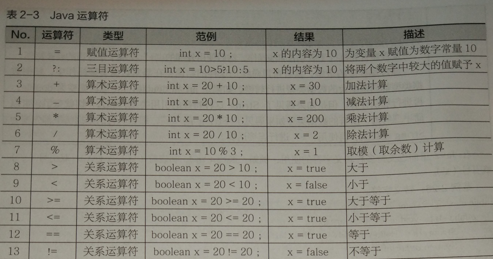
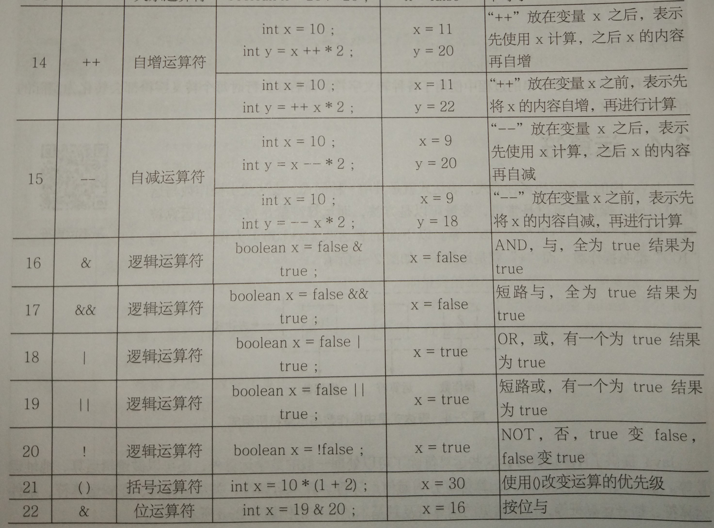
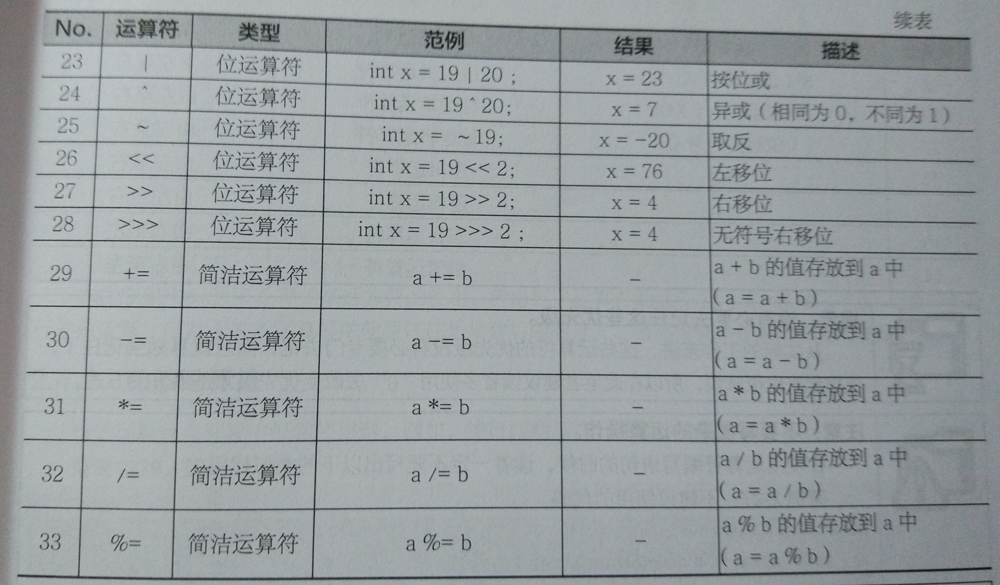
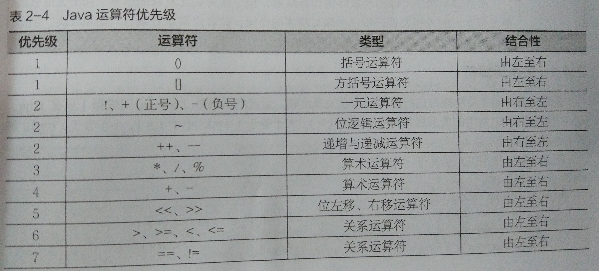
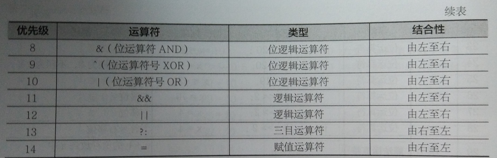

## 总述
天哪，真是拖延症晚期，距离上一篇一个月了，大家可以关注我的微信公众号：Monhitul，可查看更多内容跟资源。

## 注释
Java的注释分为3种。

* ``//``：单行注释；
* ``/*...*/``：多行注释；
* ``/**...*/``：文档注释。

采用文档注释的内容会被解释成程序的正式文档，并能够包含进如 javadoc 工具生成的文档里，用以说明该程序的层次结构及其方法。

## 标识符与关键字
标识符定义要求为：**由字母、数组、_、$组成，其中不能以数字开头，不能是Java中的关键字**。

Java中的关键字：
<table>
	<tbody>
		<tr>
			<td>abstract</td>
			<td>assert</td>
			<td>boolean</td>
			<td>break</td>
			<td>byte</td>
			<td>case</td>
			<td>catch</td>
			<td>char</td>
			<td>class</td>
			<td>const</td>
		</tr>
		<tr>
			<td>continue</td>
			<td>default</td>
			<td>do</td>
			<td>double</td>
			<td>else</td>
			<td>enum</td>
			<td>extends</td>
			<td>final</td>
			<td>finally</td>
			<td>float</td>
		</tr>
		<tr>
			<td>for</td>
			<td>goto</td>
			<td>if</td>
			<td>implements</td>
			<td>import</td>
			<td>instanceof</td>
			<td>int</td>
			<td>interface</td>
			<td>long</td>
			<td>native</td>
		</tr>
		<tr>
			<td>new</td>
			<td>package</td>
			<td>private</td>
			<td>protected</td>
			<td>public</td>
			<td>return</td>
			<td>strictfp</td>
			<td>short</td>
			<td>static</td>
			<td>super</td>
		</tr>
		<tr>
			<td>switch</td>
			<td>synchronized</td>
			<td>this</td>
			<td>throw</td>
			<td>throws</td>
			<td>transient</td>
			<td>try</td>
			<td>void</td>
			<td>volatile</td>
			<td>while</td>
		</tr>
	</tbody>
</table>

## 数据类型


Java基础数据类型的大小、范围、默认值：



```
int max = Integer.MAX_VALUE;	//取出最大值
int min = Integer.MIN_VALUE;	//取出最小值
```

**最大值如果继续增加就变成最小值，反之最小值减1就变成最大值，这种现象称为数据的溢出**。

ASCII码中，
* 大写字母范围：65~90；
* 小写字母范围：97~122。

在Java中，由于使用了UNICODE编码，这种十六进制的编码可以保存任意的文字，比如一个中文字符。

## 运算符




**``&(普通与)``跟``&&(短路与)``差别，&&如果在前面结果已经返回了false，不会再进行后面的判断了，而&所有的判断条件都要判断，无论前面结果如何，后面都会继续判断**。

**``|(普通或)``跟``||(短路或)``，||如果在前面结果已经返回了true，不会再进行后面的判断了，而|所有的判断条件都要判断，无论前面结果如何，后面都会继续判断**。

优先级：



