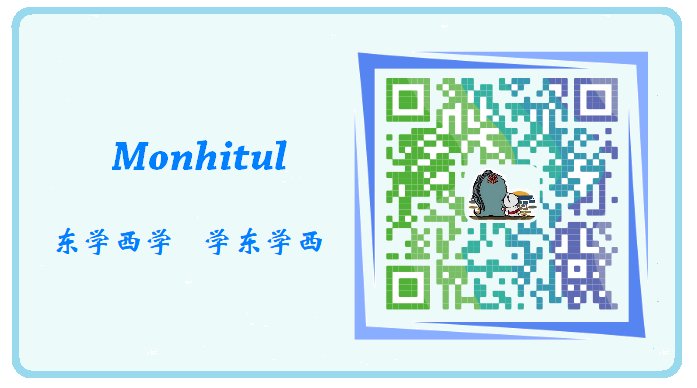

## 总述
这里说明一下，本专栏只是归纳Java的关键知识点，并不适合初学者系统地学习，如果有朋友觉得我写得还行，可以关注我的微信公众号：Monhitul，可以查看更多内容。

## 面向对象
面向对象，面向过程。

面向对象有3个主要特性：``封装性``，``继承性``，``多态性``，往后会提到。

## 基本概念
类实际上是表示一个客观世界中某类群体的一些基本特征抽象，属于抽象的概念集合，如汽车、轮船、书描述的都是某一类事物的公共特征。

而对象是表示一个个具体的事物，比如张三的汽车、李四同学，这些都是可以使用的事物，就可以理解为对象，对象表示的是一个个独立的个体。
